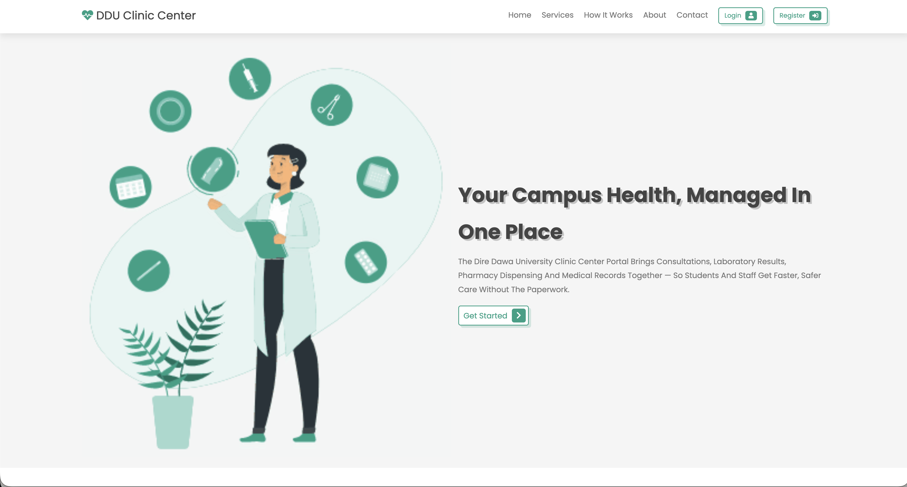
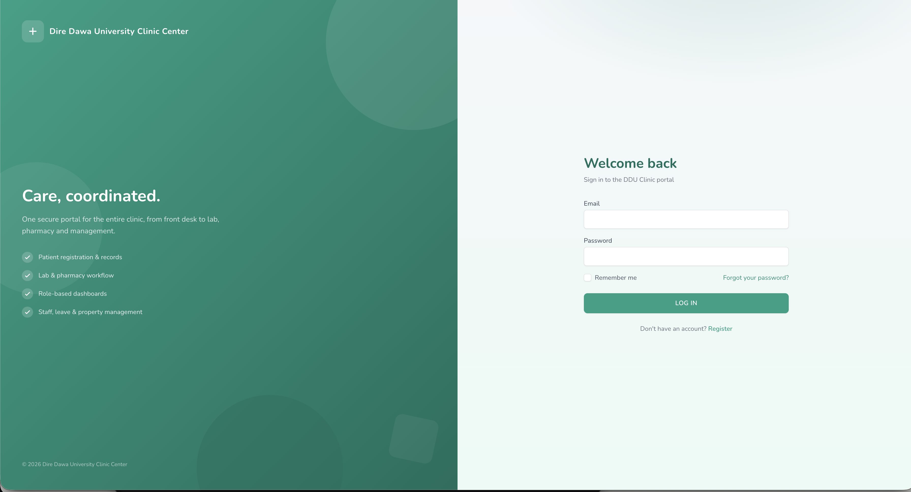
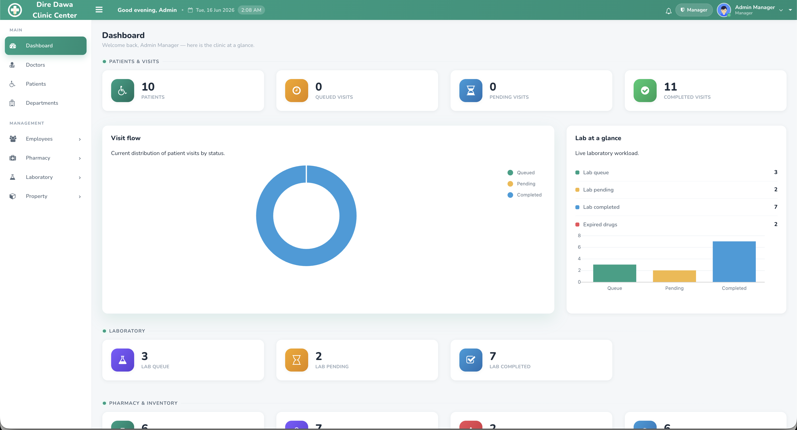
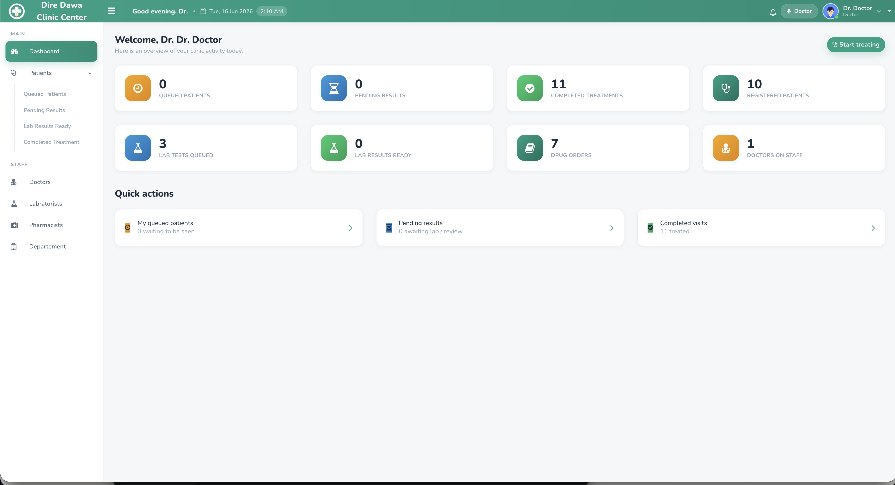

<div align="center">


# DDU Clinic — ERP Clinic Management System

### One secure portal for the entire campus clinic — front desk to lab, pharmacy and management.

A role-based ERP that digitises the full patient journey at the **Dire Dawa University Student Clinic Center**: registration → consultation → lab → pharmacy → records — with real-time queues, in-app notifications, and printable medical documents.

[](https://laravel.com)
[](https://php.net)
[](https://laravel-livewire.com)
[](#)
[](#license)

</div>

---

## ✨ Highlights

- 🩺 **End-to-end patient journey** — register, queue, diagnose, order labs & medication, dispense, and archive records in one flow.
- ⚡ **No-refresh interactions** — lists and forms are built with **Livewire 2** (live search, sort, pagination, inline validation, toast feedback).
- 🔔 **Built-in notifications** — role-aware count badges, a header bell, and a sign-in summary so nothing falls through the cracks.
- 🧪 **Smart lab routing** — completed lab results flow **back to the ordering doctor** ("Lab Results Ready") for further assessment, then on to reception.
- 💊 **Editable orders + status lifecycle** — add / edit / remove lab tests and medicines after ordering; per-item status (Not started · In progress · Done · Skipped). Pharmacy stays editable after the doctor finishes (they're off-site).
- 📄 **Printable documents** — clean A4 **sick-leave certificate** and **prescription** straight from the consult screen.
- 🗂️ **Clinical history** — past visits with diagnoses, plus one-click popups of exactly which tests/medicines were ordered.
- 🎨 **Refined green design system** — a modern, consistent UI anchored on the clinic's brand green `#16a085`.

---

## 📸 Screenshots

| Landing | Sign in |
|---|---|
|  |  |

| Manager dashboard | Doctor dashboard |
|---|---|
|  |  |

> More views (consult workspace, patient registration & records, lab/pharmacy) can be added — see the [capture guide](docs/screenshots/README.md).

---

## 👥 Roles & what they do

| Role | Lands on | Can do |
|---|---|---|
| **Receptionist** | Reception dashboard | Search/register patients, create visits, queue patients to doctors |
| **Doctor** | Doctor dashboard | Diagnose, order labs & medication, review lab results, print sick-leave & prescriptions, view clinical history |
| **Lab Technician** | Lab dashboard | See ordered tests, enter results, manage test types, set item status |
| **Pharmacist** | Pharmacy dashboard | Manage medicine stock, dispense drug orders, update dispensing status |
| **Manager / Admin** | Admin dashboard | Oversee everything — staff, departments, pharmacy & property, leave requests, clinic-wide stats |

### Demo accounts

> Seed demo data first (see Quick start), then sign in with:

| Role | Email | Password |
|---|---|---|
| Manager / Admin | `admin@clinic.test` | `password` |
| Doctor | `doctor@clinic.test` | `password` |
| Receptionist | `reception@clinic.test` | `password` |
| Lab Technician | `lab@clinic.test` | `password` |
| Pharmacist | `pharmacy@clinic.test` | `password` |

---

## 🧩 Modules

### Patient management
Patient cards, visit queues (Queued · Pending · Lab Result Completed · Completed), the doctor consult workspace (symptoms / diagnosis / disease), and a full clinical history with drill-down into past lab/medication orders.

### Laboratory
Order tests, enter & submit results to the doctor, manage test types, and track each item through its status lifecycle.

### Pharmacy
Medicine inventory with in-stock / out-of-stock / expiring views, drug-order dispensing, and stock-aware quantities. Pharmacy can update dispensing status even after the visit is closed.

### Human resources
Employee registration & profiles (with education and work-experience records), and a leave workflow with an on-leave notice and early-return request/approval.

### Store / property
Asset registration, assignment to staff, records, and stock requests.

---

## 🛠️ Tech stack

| Layer | Tech |
|---|---|
| Framework | Laravel 9 (PHP 8) |
| Reactivity | Livewire 2 |
| Auth | Laravel Jetstream + Fortify (Sanctum) |
| UI | Bootstrap admin theme + a custom design layer (`public/assets/css/enhance.css`), Tailwind on auth pages |
| Charts & UX | Chart.js, SweetAlert2, DataTables |
| Database | SQLite (dev) / MySQL (prod) |
| Build | Laravel Mix |

---

## 🚀 Quick start

```bash
# 1. Install dependencies
composer install
npm install

# 2. Environment
cp .env.example .env
php artisan key:generate
# default DB is SQLite — create the file (or set MySQL creds in .env)
touch database/database.sqlite

# 3. Database + demo data
php artisan migrate
php artisan db:seed          # creates the demo accounts + sample clinic data

# 4. Build assets & run
npm run dev                  # or: npm run prod
php artisan serve
```

Then open **http://127.0.0.1:8000** and sign in with a demo account above.

> ⚠️ **`db:seed` is destructive for demo purposes** — `DemoDataSeeder` clears the domain tables (patients, visits, orders, etc.) and reseeds them. **Do not run it against production data.**

---

## 🗺️ Project structure

```
app/Http/Controllers      # Patient, Lab, Medicine, Admin, Home controllers
app/Http/Livewire         # Livewire components (lists, forms, search)
app/Providers             # AppServiceProvider — role-aware nav counts (badges/notifications)
resources/views
 ├─ layouts/portal.blade.php   # master layout (sidebar, navbar, toasts)
 ├─ livewire/                  # Livewire component views
 ├─ admin|doctor|lab|pharmacy|reception/   # per-role dashboards, sidebars, actions
 └─ partials/                  # navbar, leave-notice, shared bits
public/assets/css/enhance.css  # the green design system
database/migrations|seeders    # schema + DemoDataSeeder
docs/                          # modernization guide + screenshots
```

---

## 🧭 Roadmap ideas

- Appointment scheduling & calendar
- Inline lab result values inside clinical history
- Real-time notifications (broadcasting)
- Reporting & analytics exports (PDF/Excel)

---

## 👤 Author

**[Bereket Zelalem](https://github.com/bereket-09)** — final-year project for the Dire Dawa University Student Clinic Center.

## 📄 License

Released under the [MIT License](#license). Free to adapt for your own clinic.
